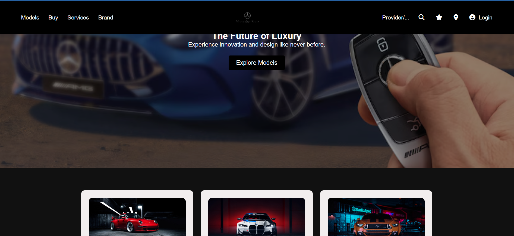

# 🚗 Mercedes-Benz Website Clone (HTML + CSS)

A simple front-end **clone of the Mercedes-Benz India website** built using only **HTML and CSS**.  
This project was created to practice **frontend development skills** such as layout, styling, and responsive design.

---

## 🔥 Features
- Responsive **navigation bar** with logo centered.
- Fullscreen **hero section** with background image and call-to-action button.
- **Car models section** with image cards and hover effects.
- Clean and minimal **footer**.
- Styled using **Flexbox, CSS Grid, and Media Queries**.

---

## 🛠️ Technologies Used
- **HTML5**
- **CSS3**
- **Font Awesome** (for icons)

---

## 📷 Preview

---

## 🚀 Live Demo
🔗 [View on GitHub Pages](https://github.com/loki2002-tech/benz-clone)

---

## 📂 Project Structure

├── index.html
├── mercedes.css
├── /imagesbenz
│ ├── benz-logo.png
│ ├── car1.png
│ ├── car2.png
│ ├── car3.png
---

## ✨ Future Improvements
- Add **dropdown menus** in navbar (Models, Buy, etc.).
- Improve **mobile responsiveness** with more media queries.
- Add animations for smoother transitions.

---

## 🙌 Acknowledgements
This project is built **for learning purposes only** and is not affiliated with or endorsed by Mercedes-Benz.

